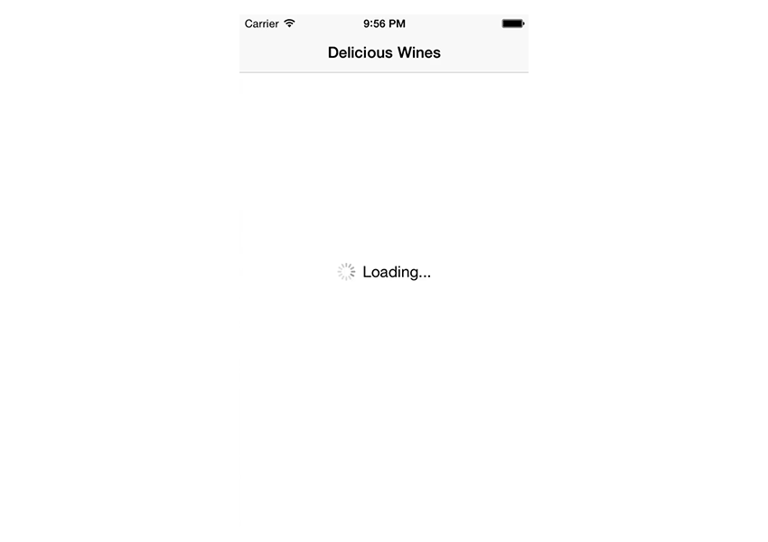
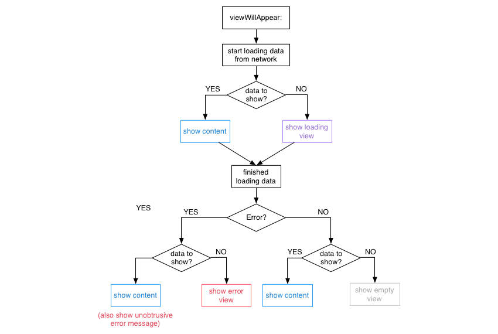

# StatefulViewController

A view controller subclass that presents placeholder views based on content, loading, error or empty states.



In a networked application a view controller typically has the following states that need to be communicated to the user:

* **Loading**: The content is currently loaded over the network.
* **Content**: The content is available and presented to the user.
* **Empty**: There is currently no content available to display.
* **Error**: An error occured whilst downloading content.

As trivial as this flow may sound, there are a lot of cases that result in a rather large decision tree.



StatefulViewController is a concrete implementation of this particular decision tree. (If you want to create your own modified version, you might be interested in the [state machine](#viewstatemachine) that is used to show and hide views.)

## Usage

Configure the `loadingView`, `emptyView` and `errorView` properties of your `StatefulViewController` subclass in `viewDidLoad`.

After that, simply tell the view controller if content is currently being loaded and it will take care of showing and hiding the correct loading, error and empty view for you.

```swift
func loadDeliciousWines() {
	startLoading()
	
	let url = NSURL(string: "http://example.com/api")
	let session = NSURLSession.sharedSession()
	let task = session.dataTaskWithURL(url) { (let data, let response, let error) in
		endLoading(error: error)
	}
	task.resume()
}
```

### StatefulViewControllerDelegate

StatefulViewController calls the `hasContent` delegate method to check if there is any content to display. If you do not implement this protocol, StatefulViewController will always assume that there is content to display.

```swift
func hasContent() -> Bool {
	return countElements(datasourceArray) > 0
}
```

Optionally, you might also be interested to respond to an error even if content is already shown. In this case, use `handleErrorWhenContentAvailable` to manually present the error to the user.

```swift
func handleErrorWhenContentAvailable(error: NSError) {
	let alertController = UIAlertController(title: "Ooops", message: "Something went wrong.", preferredStyle: .Alert)
	alertController.addAction(UIAlertAction(title: "OK", style: .Default, handler: nil))
	self.presentViewController(alertController, animated: true, completion: nil)
}
```

<a name="viewstatemachine"></a>
### View State Machine

> Note: The following section is only intended for those, who want to create a stateful controller that differs from the flow described above.

You can also use the underlying view state machine to create a similar implementation for your custom flow of showing/hiding views.

```swift
let stateMachine = ViewStateMachine(view: view)

// Add states
stateMachine["loading"] = loadingView
stateMachine["other"] = otherView

// Transition to state
stateMachine.transitionToState(.View("loading"), animated: true) {
	println("finished switching to loading view")
}

// Hide all views
stateMachine.transitionToState(.None, animated: true) {
	println("all views hidden now")
}
```

## Installation

<strike>pod "StatefulViewController", "~> 0.1"</strike>

For now, just drag and drop the two classes in the `Source` folder into your project.

## Tests

Open the Xcode project and press `⌘-U` to run the tests.

Alternatively, all tests can be run in the terminal using [xctool](https://github.com/facebook/xctool) (once it is ready for Xcode 6).

```bash
xctool -scheme Tests -sdk iphonesimulator test
```

## Todo

* Default loading, error, empty views
* Protocol on views that notifies them of removal and add
* Views can provide delays in order to tell the state machine to show/remove them only after a specific delay (e.g. for hide and show animations)


## Contributing

* Create something awesome, make the code better, add some functionality,
  whatever (this is the hardest part).
* [Fork it](http://help.github.com/forking/)
* Create new branch to make your changes
* Commit all your changes to your branch
* Submit a [pull request](http://help.github.com/pull-requests/)


## Contact

Feel free to get in touch.

* Website: <http://schuch.me>
* Twitter: [@schuchalexander](http://twitter.com/schuchalexander)